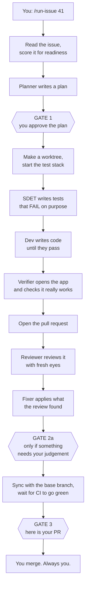

# How ai-workflow works

Read this before your first run. It goes from "what is this" down to the individual
mechanisms, one layer at a time. You can stop at any layer and still understand enough to
use it.

---

## Layer 0 — The idea in one paragraph

You hand it a GitHub issue. It writes the tests, writes the code, checks the feature
actually works, opens a pull request, reviews that pull request, fixes what the review
found, and hands it back to you ready to merge. It stops to ask you something **exactly
three times**. Everything else it either fixes itself or writes down and tells you about at
the end.

The thing that makes it different from "an AI that writes code" is that **no step is
trusted on its word**. Each step has to produce evidence, and the evidence is checked by
something that has no reason to be generous.

---

## Layer 1 — The five pieces

| Piece | Plain English | Where |
|---|---|---|
| **The orchestrator** | The to-do list for the whole job. Runs in your session, talks to you. | `commands/run-issue.md` |
| **Stations** | Specialists. One writes tests, one writes code, one reviews. Each gets a fresh mind — no memory of the others. | `agents/run-*.md` |
| **The envelope** | The form a station fills in when it finishes. Always the same shape. | defined in `run-engine/engine.py` |
| **The engine** | The traffic controller. Reads the envelope, decides who goes next. Never guesses. | `run-engine/` |
| **The ledger** | One JSON file per run. What has happened, who holds the baton, what budgets are left. | `run.json` |

The important relationship: **the orchestrator does not decide what happens next.** It hands
the envelope to the engine and does what the engine prints. That is why a run behaves the
same on Tuesday as it did on Monday.

---

## Layer 2 — One run, start to finish



**Nothing in this pipeline ever merges.** That is yours, every time.

### What actually happens at each step

1. **Read the issue.** A researcher reads the issue, its comments, related past issues, and
   your notes. It also scores the issue against a *Definition of Ready* — six questions like
   "is there a testable acceptance criterion?". A thin issue does not stop the run; the gaps
   get shown to you at Gate 1, next to the plan, where you can actually act on them.
2. **Plan.** A planner reads the issue and the codebase and writes one document: which tests
   to write, where they go, how to build it, what could go wrong.
3. **GATE 1.** You read the plan and approve, revise, or abort. Revising loops as many times
   as you like — it is the one unbounded loop in the system, and a human is present for it.
4. **Worktree and stack.** A separate checkout on a new branch, so your working copy is
   untouched. If the repo has a test compose file, a Docker stack comes up under its own
   name (`runissue-41`), capped so it cannot eat your machine.
5. **SDET.** Writes the tests *first*, and has to prove they **fail** — a test that passes
   before the feature exists is testing nothing.
6. **Dev.** Writes code until the tests pass. **It is not allowed to touch the tests.** More
   on that below; it is enforced, not requested.
7. **Verifier.** Opens the running app and checks the feature works for real. Unit tests
   prove the parts behave; this asks whether the thing does what the issue asked for.
8. **PR.** Links the branch to the issue, pushes, opens the pull request.
9. **Review.** A reviewer with **no memory of the plan or the code being written** reviews
   the diff. On a risky diff, extra single-lens specialists (security, performance, API
   contract) review in parallel and the generalist folds their verdicts into one review.
10. **Fix.** A fixer applies every actionable finding, replies on each thread, resolves it,
    and pushes once.
11. **GATE 2a** — *only if* the review raised something an automated pass should not be the
    last word on. Often this never fires.
12. **Sync and CI.** Merge the base branch in, re-run the tests, and wait for CI to be
    actually green. A local pass is necessary and not sufficient.
13. **GATE 3.** One report: the PR, what the review caught, what is still open, whether CI
    is green, and anything it would have asked you about but wrote down instead.

---

## Layer 3 — The mechanisms, one at a time

This is the part that makes the difference between "an agent wrote some code" and something
you can leave alone.

### 3.1 The envelope — one shape, always

Every station returns exactly one JSON object. Always these fields:

```json
{
  "issue": 41,
  "station": "dev",
  "status": "passed",
  "attempt": 1,
  "summary": "implemented per plan; suite green",
  "evidence": { "commands": [ { "cmd": "...", "exit": 0, "excerpt": "42 passed" } ] },
  "handoff": { "...station-specific..." }
}
```

**`status` has exactly three values, on purpose:**

- `passed` — I did my job.
- `bounce` — I found a defect in someone *else's* work; send it back to them.
- `escalate` — I hit a wall I cannot get around.

There is deliberately **no `blocked`**. A station cannot invent a fourth thing for you to
answer. That is how "exactly three gates" is enforced structurally rather than by asking
everyone to behave.

**`evidence.commands[]` is required** from any station claiming `passed`. It records what it
actually ran. This catches a *skipped* step. It does not catch a determined liar — a pasted
command looks identical to a real one — which is why the next mechanism exists.

### 3.2 Post-checks — don't trust, verify

A `passed` envelope is a *claim*. Before routing it, the engine tries to **refute** it using
something with no incentive to agree:

| Station | Its claim | What actually checks it |
|---|---|---|
| SDET | "the tests are red" | run the suite. **If it is green, refuse** — there is no red to prove. |
| Dev | "implemented, suite green" | the commit resolves in git; no undeclared files in the diff; the suite really exits 0 |
| Verifier | "the feature works" | its verdict must agree with its own criteria; any screenshot it names must exist on disk |
| Reviewer | "review posted" | fetch that review from GitHub; the panel must match what policy chose |
| Fixer | "all findings applied" | **every review thread must actually be resolved**, and the push must have happened |

The fixer one is the motivating case. Before this existed, a fixer could report success with
three threads still open and nothing pushed, and the run would carry on.

**When a check refutes a claim**, the station is sent back to redo its own work — once. If it
fails again, the run *continues anyway* and the failure is written into the final report.
That is deliberate: a spent budget is something to tell you about, not a reason to abandon
the work done so far.

### 3.3 The test-ownership guard

The SDET owns the tests. The dev makes them pass by writing *product* code.

The tempting cheat is to edit the test. So after every dev step, the engine runs:

```
git diff <the SDET's commit>..HEAD -- <the test directory>
```

Anything there is a violation. Note it diffs **commits**, not the working copy — an earlier
version checked the working copy, and committing the edit hid it completely.

On a violation the engine sends it back to the SDET automatically, spends one of the retry
budget, and tells the orchestrator to revert the files first. Tampering therefore cannot
loop forever.

### 3.4 Budgets, and why they are per-pair

When one station sends work back to another, that is a **bounce**. Bounces are counted per
*pair*, not per station:

```
"verifier->dev": 1
"dev->sdet":     1
```

Keeping them separate matters. If the verifier sends work back to dev twice, that must not
eat the budget dev needs to dispute a wrong test. Merging them would make one station's bad
day silently spend another's allowance.

Default cap is 2 per pair. Exceeding it escalates.

### 3.5 The three gates, and the rule behind them

1. **Gate 1 — the plan.** Always fires.
2. **Gate 2a — a finding that needs your judgement.** Fires only if one is raised.
3. **Gate 3 — here is your PR.** Always fires, and it is the only ending.

**The rule:** anything else the pipeline is tempted to ask you gets *recorded and carried to
Gate 3 instead*. A spent budget, a failed verification, a stack that would not start, an
unpushable branch — none of those is a question. They are outcomes, and the final report has
to state them plainly.

When something goes wrong badly enough that the work is not finished, the run still lands at
Gate 3 — with a **draft** PR and the reason attached. A draft cannot be merged by accident,
and it gives you a diff to read instead of a half-finished worktree to find later.

### 3.6 Fresh eyes are a feature

The reviewer is given the PR and **not** the plan, and not the conversation in which the code
was written. Someone who just watched code being written cannot review it — they already
believe it. The specialists work the same way: one lens each, no shared context, results
folded together afterwards.

### 3.7 The worktree and the stack

- **Worktree** — a second checkout in a sibling directory on a new branch. Your working copy
  is never touched. Gitignored files the tests need (`.env`, key material) are copied in,
  because a fresh checkout does not have them and their absence shows up much later as
  confusing test failures.
- **Stack** — if the repo has a test compose file, one Docker stack comes up per run, named
  `runissue-<issue>`, with CPU and memory caps. One command string (`test_cmd`) is resolved
  once and **every station runs that exact string, unchanged**. Nobody re-detects it, and no
  station is allowed to start its own stack. Three phases each starting an uncapped stack is
  what pegged a developer's machine once.
- **No compose file?** Then `stack=none`, the host test runner is used, and everything else
  works identically. Most repos take this path.

---

## Layer 4 — Epics

For work too big for one pull request.

`/gh-issue` can split a large brief into a **parent** issue plus several **children**, each
of which is a complete, independently-readable issue — not a fragment that says "see
parent". Children declare their order in plain text:

```
Depends on: #12, #13
```

Then `/run-issue <parent>` drives them all. The rules:

- **Independent children run at the same time.** Dependent ones cannot, by definition — a
  child stacks its branch on top of the branch it depends on, so it waits for that one to
  reach "PR open" first.
- **Still three gates, for the whole epic.** Gate 1 shows you the split and *every* child's
  plan at once. A blocker in one child parks that child and the others keep going; Gate 2a
  fires once, when nothing more can proceed without you. Gate 3 is one report covering
  everything, including the order you must merge in.
- **A failed child with dependents is reported by name.** "Never started, blocked by #14" —
  because a child silently missing from a list of twelve is how you discover a month later
  that a third of the epic was never built.

Optionally it also creates a Kanban view in your GitHub Project filtered to that epic, so
you can see the whole thing at a glance.

---

## Layer 5 — When things go wrong

| You see | It means | What happens |
|---|---|---|
| `bounce(sdet)` with exit code 6 | dev edited a test | files reverted, sent back to the SDET, one retry spent |
| exit code 7 | a post-check refuted a `passed` claim | that station redoes its own work, once |
| `escalate: ...` | a budget is spent or a wall was hit | draft PR opened, reason recorded, lands at Gate 3 |
| `stack=failed` | Docker would not come up | run continues, tests unverified, **said loudly** in the report |
| `stack=none` | no test compose file | normal; the host runner is used |
| `app_url=none` | nothing to open in a browser | runtime verification skipped, and the report says so |
| `UNVERIFIABLE` | the verifier could not see the app | a pass with a note, never a stop |

The pattern: **a gate that silently stops running is worse than one that runs and fails.**
Anything skipped is named in the final report.

---

## Glossary

- **Station** — one specialist agent with one job and a fresh context.
- **Envelope** — the fixed-shape JSON a station returns.
- **Ledger** (`run.json`) — the single source of truth for a run. Never hand-edited.
- **Bounce** — sending work back to an earlier station.
- **Post-check** — code that tries to disprove a station's claim before the run moves on.
- **Test root** — the directory the SDET owns and the dev may not touch.
- **Degraded finish** — the ending where the work is not done: draft PR, reason attached,
  still one report.
- **Worktree** — the throwaway checkout a run works in.
- **Epic** — a parent issue with dependent children.

---

## The one-line version

Every claim is checked by something that does not want it to be true, and you are
interrupted exactly three times. Everything else it handles, writes down, and tells you
about at the end.
