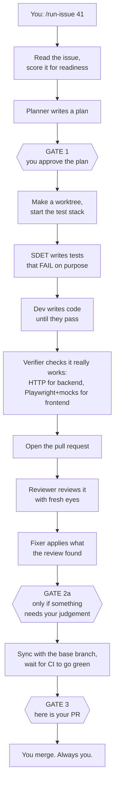
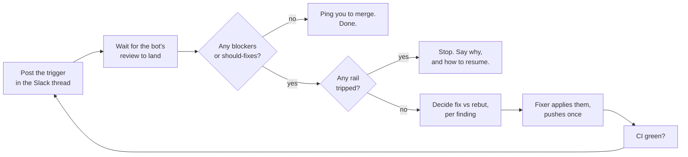

# How ai-workflow works

Read this before your first run. It goes from "what is this" down to the individual
mechanisms, one layer at a time. You can stop at any layer and still understand enough to
use it.

---

## Layer 0 — The idea in one paragraph

You hand it a GitHub issue. It writes the tests, writes the code, checks the feature
actually works, opens a pull request, reviews that pull request, fixes what the review
found, and hands it back to you ready to merge. It stops to ask you something **exactly
three times**. Everything else it either fixes itself or writes down and tells you about at
the end.

The thing that makes it different from "an AI that writes code" is that **no step is
trusted on its word**. Each step has to produce evidence, and the evidence is checked by
something that has no reason to be generous.

---

## Layer 1 — The five pieces

| Piece | Plain English | Where |
|---|---|---|
| **The orchestrator** | The to-do list for the whole job. Runs in your session, talks to you. | `commands/run-issue.md` |
| **Stations** | Specialists. One writes tests, one writes code, one reviews. Each gets a fresh mind — no memory of the others. | `agents/run-*.md` |
| **The envelope** | The form a station fills in when it finishes. Always the same shape. | defined in `run-engine/engine.py` |
| **The engine** | The traffic controller. Reads the envelope, decides who goes next. Never guesses. | `run-engine/` |
| **The ledger** | One JSON file per run. What has happened, who holds the baton, what budgets are left. | `run.json` |

The important relationship: **the orchestrator does not decide what happens next.** It hands
the envelope to the engine and does what the engine prints. That is why a run behaves the
same on Tuesday as it did on Monday.

---

## Layer 2 — One run, start to finish



**Nothing in this pipeline ever merges.** That is yours, every time.

### What actually happens at each step

1. **Read the issue.** A researcher reads the issue, its comments, related past issues, and
   your notes. It also scores the issue against a *Definition of Ready* — six questions like
   "is there a testable acceptance criterion?". A thin issue does not stop the run; the gaps
   get shown to you at Gate 1, next to the plan, where you can actually act on them.
2. **Plan.** A planner reads the issue and the codebase and writes one document: which tests
   to write, where they go, how to build it, what could go wrong.
3. **GATE 1.** You read the plan and approve, revise, or abort. Revising loops as many times
   as you like — it is the one unbounded loop in the system, and a human is present for it.
4. **Worktree and stack.** A separate checkout on a new branch, so your working copy is
   untouched. If the repo has a test compose file, a Docker stack comes up under its own
   name (`runissue-41`), capped so it cannot eat your machine.
5. **SDET.** Writes the tests *first*, and has to prove they **fail** — a test that passes
   before the feature exists is testing nothing.
6. **Dev.** Writes code until the tests pass. **It is not allowed to touch the tests.** More
   on that below; it is enforced, not requested.
7. **Verifier.** Checks the feature works for real, on whichever side of the stack the diff
   touched. A backend change is hit over real HTTP — login, then every response state the
   route can return, not just the happy path. A frontend change is driven with Playwright
   against a mocked API, so every state (loading, empty, error, permission-denied, success)
   can be forced instead of hoped for. A PR touching both gets both, backend first — its
   captured responses become the frontend's mocks, so the two halves can't quietly disagree.
   Unit tests prove the parts behave; this asks whether the thing does what the issue asked
   for, from outside the process.
8. **PR.** Links the branch to the issue, pushes, opens the pull request.
9. **Review.** A reviewer with **no memory of the plan or the code being written** reviews
   the diff. On a risky diff, extra single-lens specialists (security, performance, API
   contract) review in parallel and the generalist folds their verdicts into one review.
10. **Fix.** A fixer applies every actionable finding, replies on each thread, resolves it,
    and pushes once.
11. **GATE 2a** — *only if* the review raised something an automated pass should not be the
    last word on. Often this never fires.
12. **Sync and CI.** Merge the base branch in, re-run the tests, and wait for CI to be
    actually green. A local pass is necessary and not sufficient.
13. **GATE 3.** One report: the PR, what the review caught, what is still open, whether CI
    is green, and anything it would have asked you about but wrote down instead.
14. **Write it down.** Two side-channels, both best-effort, both one warning line if they
    fail: the run gets summarised into your notes vault, and any durable lesson is appended
    to the repo's `tasks/lessons.md` — evidence-backed only, and left uncommitted so it
    lands in a commit a human read.
15. **Tear down, then grind.** The Docker stack comes down, and *then* the review loop
    starts. See Layer 4 — Gate 3 is where the pipeline hands you the PR, not where the work
    stops.

---

## Layer 3 — The mechanisms, one at a time

This is the part that makes the difference between "an agent wrote some code" and something
you can leave alone.

### 3.1 The envelope — one shape, always

Every station returns exactly one JSON object. Always these fields:

```json
{
  "issue": 41,
  "station": "dev",
  "status": "passed",
  "attempt": 1,
  "summary": "implemented per plan; suite green",
  "evidence": { "commands": [ { "cmd": "...", "exit": 0, "excerpt": "42 passed" } ] },
  "handoff": { "...station-specific..." }
}
```

**`status` has exactly three values, on purpose:**

- `passed` — I did my job.
- `bounce` — I found a defect in someone *else's* work; send it back to them.
- `escalate` — I hit a wall I cannot get around.

There is deliberately **no `blocked`**. A station cannot invent a fourth thing for you to
answer. That is how "exactly three gates" is enforced structurally rather than by asking
everyone to behave.

**`evidence.commands[]` is required** from any station claiming `passed`. It records what it
actually ran. This catches a *skipped* step. It does not catch a determined liar — a pasted
command looks identical to a real one — which is why the next mechanism exists.

### 3.2 Post-checks — don't trust, verify

A `passed` envelope is a *claim*. Before routing it, the engine tries to **refute** it using
something with no incentive to agree:

| Station | Its claim | What actually checks it |
|---|---|---|
| SDET | "the tests are red" | run the suite. **If it is green, refuse** — there is no red to prove. |
| Dev | "implemented, suite green" | the commit resolves in git; no undeclared files in the diff; the suite really exits 0 |
| Verifier | "the feature works" | its verdict must agree with its own criteria; any screenshot it names must exist on disk |
| Reviewer | "review posted" | fetch that review from GitHub; the panel must match what policy chose |
| Fixer | "all findings applied" | **every review thread must actually be resolved**, and the push must have happened |

The fixer one is the motivating case. Before this existed, a fixer could report success with
three threads still open and nothing pushed, and the run would carry on.

**When a check refutes a claim**, the station is sent back to redo its own work — once. If it
fails again, the run *continues anyway* and the failure is written into the final report.
That is deliberate: a spent budget is something to tell you about, not a reason to abandon
the work done so far.

### 3.3 The test-ownership guard

The SDET owns the tests. The dev makes them pass by writing *product* code.

The tempting cheat is to edit the test. So after every dev step, the engine runs:

```
git diff <the SDET's commit>..HEAD -- <the test directory>
```

Anything there is a violation. Note it diffs **commits**, not the working copy — an earlier
version checked the working copy, and committing the edit hid it completely.

On a violation the engine sends it back to the SDET automatically, spends one of the retry
budget, and tells the orchestrator to revert the files first. Tampering therefore cannot
loop forever.

### 3.4 Budgets, and why they are per-pair

When one station sends work back to another, that is a **bounce**. Bounces are counted per
*pair*, not per station:

```
"verifier->dev": 1
"dev->sdet":     1
```

Keeping them separate matters. If the verifier sends work back to dev twice, that must not
eat the budget dev needs to dispute a wrong test. Merging them would make one station's bad
day silently spend another's allowance.

Default cap is 2 per pair. Exceeding it escalates.

### 3.5 The three gates, and the rule behind them

1. **Gate 1 — the plan.** Always fires.
2. **Gate 2a — a finding that needs your judgement.** Fires only if one is raised.
3. **Gate 3 — here is your PR.** Always fires, and it is the only ending.

**The rule:** anything else the pipeline is tempted to ask you gets *recorded and carried to
Gate 3 instead*. A spent budget, a failed verification, a stack that would not start, an
unpushable branch — none of those is a question. They are outcomes, and the final report has
to state them plainly.

When something goes wrong badly enough that the work is not finished, the run still lands at
Gate 3 — with a **draft** PR and the reason attached. A draft cannot be merged by accident,
and it gives you a diff to read instead of a half-finished worktree to find later.

### 3.6 Fresh eyes are a feature

The reviewer is given the PR and **not** the plan, and not the conversation in which the code
was written. Someone who just watched code being written cannot review it — they already
believe it. The specialists work the same way: one lens each, no shared context, results
folded together afterwards.

### 3.7 The worktree and the stack

- **Worktree** — a second checkout in a sibling directory on a new branch. Your working copy
  is never touched. Gitignored files the tests need (`.env`, key material) are copied in,
  because a fresh checkout does not have them and their absence shows up much later as
  confusing test failures.
- **Stack** — if the repo has a test compose file, one Docker stack comes up per run, named
  `runissue-<repo-slug>-<digest>-<issue>` and with every port force-published to an
  OS-chosen host port, with CPU and memory caps. One command string (`test_cmd`) is
  resolved once and **every station runs that exact string, unchanged**. Nobody
  re-detects it, and no station is allowed to start its own stack. Three phases each
  starting an uncapped stack is what pegged a developer's machine once.
- **No compose file?** Then `stack=none`, the host test runner is used, and everything else
  works identically. Most repos take this path.
- **One stack at a time per project.** `stack up` takes a lockfile keyed to the repo+issue's
  Compose project before starting Docker and holds it for as long as the stack is up; a
  second run *on the same project* waits (`--lock-timeout`, default 900s) and then degrades
  to `stack=failed` naming the holder rather than starting a second stack alongside it. A run
  on a different project (a different issue, or the same issue in a different repo) never
  contends for that lock at all. Acquiring a *free* lock is a single OS-level atomic create
  (`O_CREAT | O_EXCL`), so it holds across separate `aiw stack up` processes, not just threads within
  one. Staleness is ledger-status-based, not pid-based: a holder whose run has reached `done`
  or `escalated` is reclaimed immediately, and a holder still `running` (or whose ledger
  can't be read at all) is reclaimed once past a bounded grace window instead of blocking
  forever. Reclaiming a *stale* lock is a second, separately-guarded exclusion problem — every
  contender that sees the same stale holder would otherwise agree it's stale and race to
  replace it — so the break itself is gated behind its own `O_EXCL`-created sentinel file:
  only the one process that creates the sentinel is allowed to remove the stale lock and
  retry, everyone else backs off untouched and retries against the fresh lock instead.

---

## Layer 4 — After the handback: the grind

Gate 3 gives you a reviewed PR. But a PR usually gets reviewed *again* — by a bot in a Slack
thread, by a person, by CI. `pr-grind` is the loop that works those rounds without you
sitting in it.

It runs **in your session**, not as a sub-agent, because it needs to sleep and wake for
hours, and the tools that let it do that die with a sub-agent. And it runs **after** the
Docker stack comes down, so a loop that might live all afternoon is not holding a stack open.

### One round



**Triage is the loop's job, not the fixer's.** `run-fixer` auto-applies everything it is
handed and cannot decline a finding — so something upstream has to decide what it is handed.
The default is *fix*. A **rebuttal** needs concrete evidence the finding is wrong: the
concern is already handled elsewhere in the diff, the suggested change would break a passing
test, the premise is factually incorrect about the code. **Unsure is not a rebuttal** — it
goes on the fix list.

### The four rails

A rail firing means *stop this round*. First one to fire wins.

| Rail | Why it exists |
|---|---|
| **10 rounds** | A loop that has gone ten rounds is not converging. |
| **CI is red** | Never push review fixes onto a broken branch. This one escalates **once** before stopping: `run-ci` gets exactly one attempt per head SHA — never two, here or anywhere else. |
| **A real person commented** | Automation ends when a human weighs in. A *bot* commenting doesn't count, and an unknown named account is treated as a person, which is the safe default. |
| **You said hold** | Said to the session, not in Slack. Nothing you post in the thread reaches it. |

### The stall detector

Each finding gets a fingerprint — its file and line plus the first stretch of its text — so
the loop can tell when the reviewer is asking for the same thing twice.

- **New** → fix it normally.
- **Seen once before** → fix it, but with a more capable model, explicitly told to work out
  *why the last fix did not satisfy the reviewer* before writing another one. Repeating the
  same fix harder is the failure this catches.
- **Seen twice before** → stop the whole loop. It is stuck, and one stuck finding halts the
  round rather than being quietly left behind while everything else proceeds.

### Nothing is listening

This is the part worth internalising. When the loop stops for you, **it is not waiting** —
it is over. There is no webhook from Slack back to Claude, and the sleep-and-wake machinery
dies with the session. A reply you post in the thread reaches nothing.

So a paused stop does three things and no more: records why, posts the reason ending in a
literal resume instruction, and stops. It never implies it is watching. You restart it by
re-running `/pr-grind <thread url>` yourself.

One quirk you will see: **the bot replies to any message in the thread**, mention or not —
including a post announcing the loop has stopped. That is not a new round. The loop only
counts entries from GitHub's reviews API at the current head SHA, so a chatty bot is
correctly invisible to it.

And still: **merging is manual.** The grind ends by @-mentioning you to do it.

## Layer 5 — Epics

`/gh-issue` always breaks a request into a numbered task list before filing anything. One
task files one issue as before; two or more tasks file a **parent** issue plus several
**children**, each of which is a complete, independently-readable issue — not a fragment
that says "see parent". Children declare their order in plain text:

```
Depends on: #12, #13
```

Then `/run-issue <parent>` drives them all. The rules:

- **Independent children run at the same time.** Dependent ones cannot, by definition — a
  child stacks its branch on top of the branch it depends on, so it waits for that one to
  reach "PR open" first.
- **Still three gates, for the whole epic.** Gate 1 shows you the split and *every* child's
  plan at once. A blocker in one child parks that child and the others keep going; Gate 2a
  covers both an immediate, per-blocker ask fired as soon as that child parks (so you are
  not left waiting until the end to hear about it) and an end-of-run closer that fires once,
  collecting whatever is still pending or deferred when nothing more can proceed without
  you. Gate 3 is one report covering everything, including the order you must merge in.
- **A failed child with dependents is reported by name.** "Never started, blocked by #14" —
  because a child silently missing from a list of twelve is how you discover a month later
  that a third of the epic was never built.
- **A child-create failure partway through is a recoverable state, not a failure state.**
  `/gh-issue` reports which issues exist and which are missing, then asks whether to retry
  the missing ones or stop here; nothing already created is auto-closed or deleted.

Optionally it also creates a Kanban view in your GitHub Project filtered to that epic, so
you can see the whole thing at a glance.

---

## Layer 6 — When things go wrong

| You see | It means | What happens |
|---|---|---|
| `bounce(sdet)` with exit code 6 | dev edited a test | files reverted, sent back to the SDET, one retry spent |
| exit code 7 | a post-check refuted a `passed` claim | that station redoes its own work, once |
| `escalate: ...` | a budget is spent or a wall was hit | draft PR opened, reason recorded, lands at Gate 3 |
| `stack=failed` | Docker would not come up | run continues, tests unverified, **said loudly** in the report |
| `stack=none` | no test compose file | normal; the host runner is used |
| `api_url=none` / `web_url=none` | nothing to hit over HTTP / nothing to open in a browser | that mode's runtime verification skipped, and the report says so |
| `UNVERIFIABLE` (a mode) | the verifier could not see that side | a pass with a note, never a stop |
| `FAIL` in either mode | the rollup verdict for the whole station | worst-of-both-modes; one bounce carries both modes' findings |

The pattern: **a gate that silently stops running is worse than one that runs and fails.**
Anything skipped is named in the final report.

---

## Glossary

- **Station** — one specialist agent with one job and a fresh context.
- **Envelope** — the fixed-shape JSON a station returns.
- **Ledger** (`run.json`) — the single source of truth for a run. Never hand-edited.
- **Bounce** — sending work back to an earlier station.
- **Post-check** — code that tries to disprove a station's claim before the run moves on.
- **Test root** — the directory the SDET owns and the dev may not touch.
- **Degraded finish** — the ending where the work is not done: draft PR, reason attached,
  still one report.
- **Worktree** — the throwaway checkout a run works in.
- **Epic** — a parent issue with dependent children.
- **Grind** — the post-handback loop that works repeated review rounds on an open PR.
- **Rail** — a condition that stops the grind rather than letting it push another fix.
- **Fingerprint** — how a finding is recognised across rounds, so a repeat is visible.
- **Paused stop** — the grind ended and is not watching. Only you can restart it.

---

## The one-line version

Every claim is checked by something that does not want it to be true, and you are
interrupted exactly three times. Everything else it handles, writes down, and tells you
about at the end.
